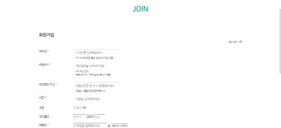

## 베이커리 웹 사이트 🍞
베이커리 상품을 구경 및 주문할 수 있는 웹 사이트입니다❕ 
 

## 목차 ✔️
  - [개요](#개요)
  - [개발환경](#개발환경)
  - [화면](#화면)
  - [기능](#기능)

## 개요 ✏️
* 프로젝트 이름: Jin Bakery
* 프로젝트 제작 기간: 2021.05-2021.06
* 개발 인원: 이소진(1인 개인 프로젝트)

## 개발환경 🛠️
* 개발 언어: Java, JavaScript
* 서버: Apache Tomcat v9.0
* DB: MySQL
* IDE: Eclipse
* 라이브러리: BootStrap

## 화면 📱

  

    
    
    
    
    
    
    
  

## 기능 🖤
* 사용자 기능
  * 회원가입 및 로그인
  * 베이커리 상품 및 상세 정보 확인
  * 베이커리 상품 구매 및 취소
* 관리자 기능
  * 베이커리 상품 추가·편집·삭제
